# Visual health on darwin

Approved fixture captures of the real Electron UI on darwin (OS 24.5.0, Electron 44.5.1). The primary gallery in [README.md](README.md) is the Windows source machine's; this page stands beside it, never in its place. See [rules](RULES.md).

Reviewed by Codex independent host reviewer. Reviewed the clean macOS fixture recapture at 5e0cf08c against the same-machine compatibility candidate. Artifact hashes and all 44 paired stills matched the manifests, with identical recorded control geometry. Inspected the four changed still pairs and the nine fixture motion sequences. The largest changes were the disposable CLI path and a narrow goal frame. The older approved run used a different Darwin release. This approval records the current-machine comparison baseline. The focused host-profile tests passed on the candidate. Native candidate loading, save and rollback require separate evidence.

Source commit: 5e0cf08c6b995977dfaa44c0d539c3568ba322c0; review: docs/visual/reviews/approval-4d99dbb743d9d596136a9ad6a3769a5e1bf32c1c35b0e201b0aaddaedf78d43c.json.

## workspace

Real desktop navigation with disposable local notes; no cloud or provider.

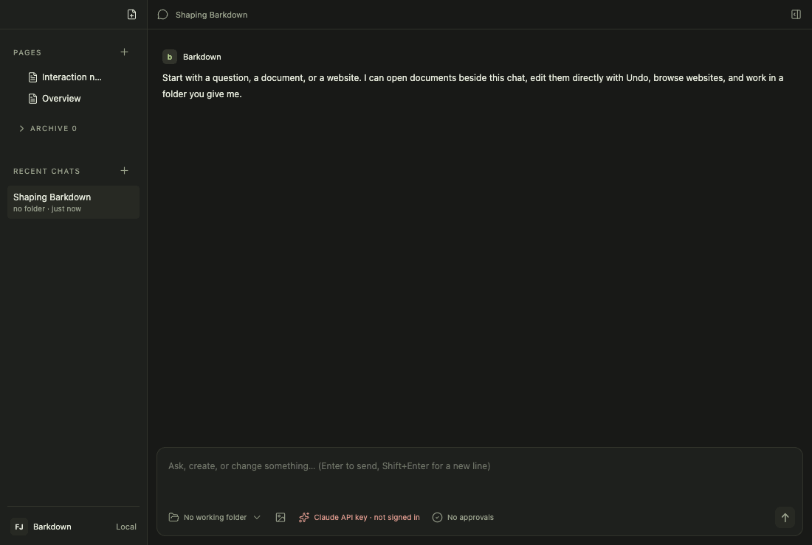

## chat

Shared main composer: draft, provider chooser and model chooser. No message is sent.

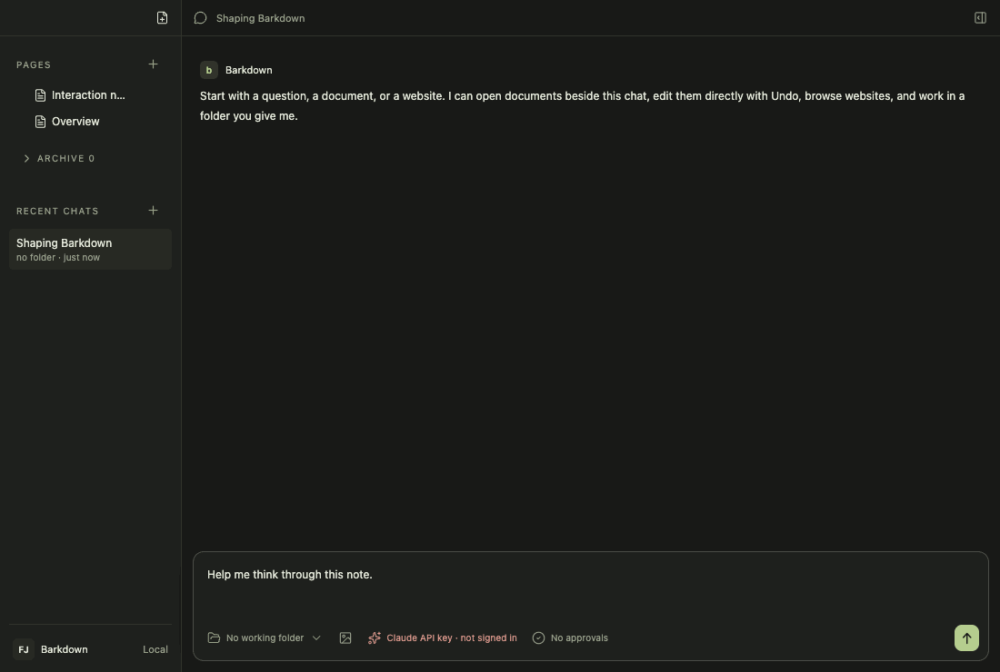

## side-chat

A real saved side conversation and its independent composer, using disposable fixture state.

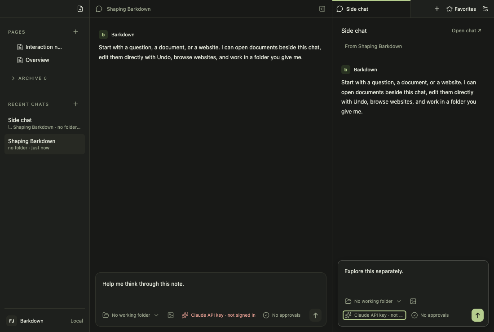

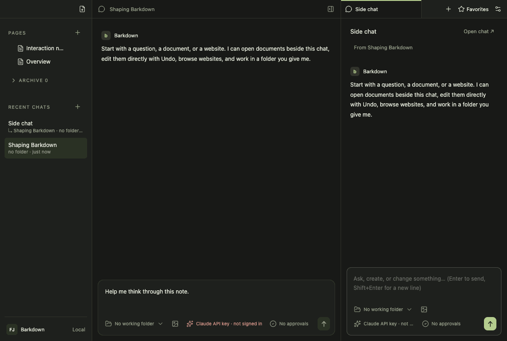

## documents

Read-only legacy document viewer. The light frame is a theme-contrast comparison; no Paper server or editing is used.

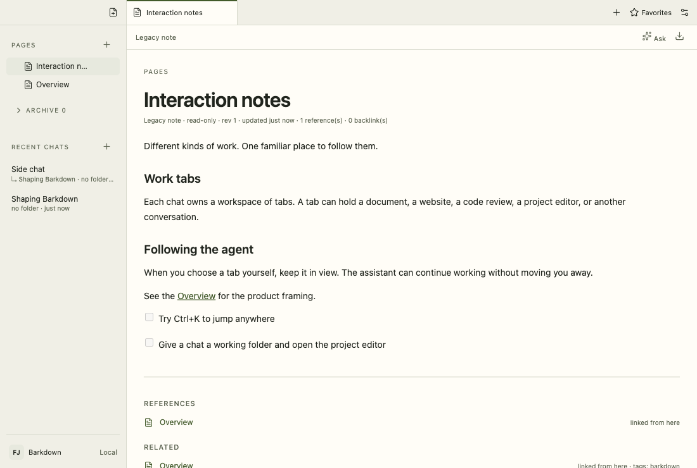

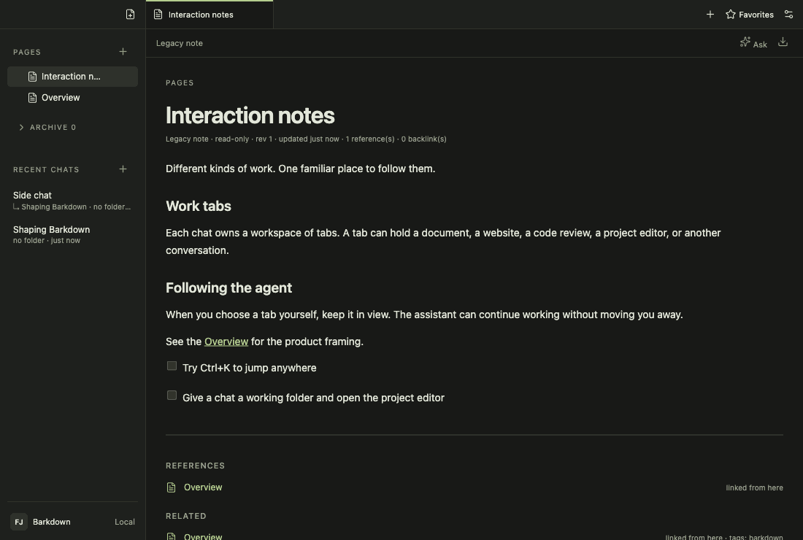

## retained

After the library switch the legacy notes are retained read-only. Dark by default; the light frame compares theme contrast. Fixture journal; no Paper server.

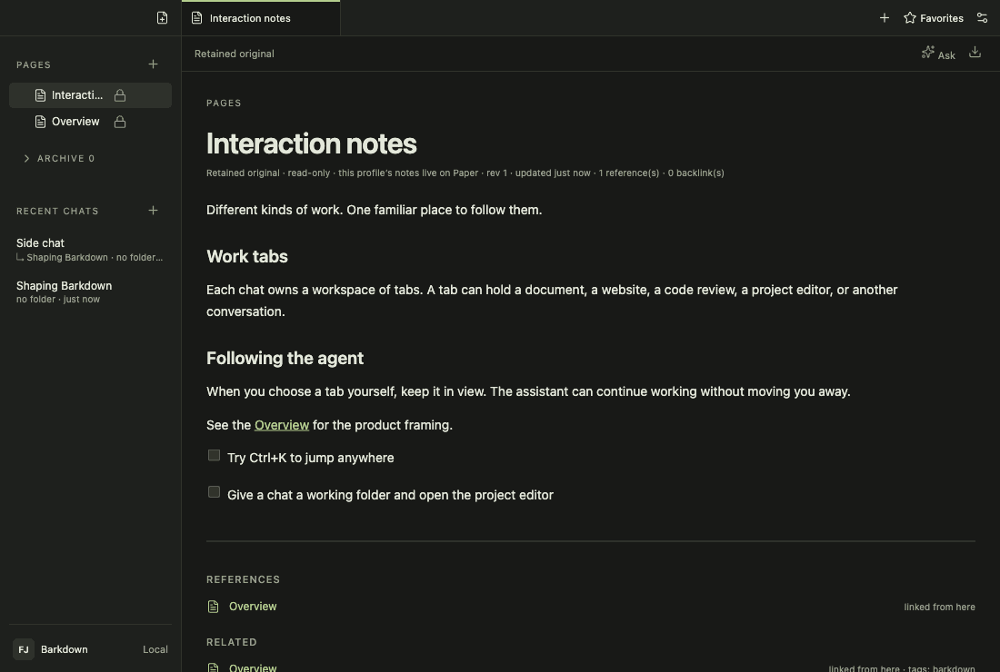

## settings

Real Settings navigation. No server connection or credential is configured.

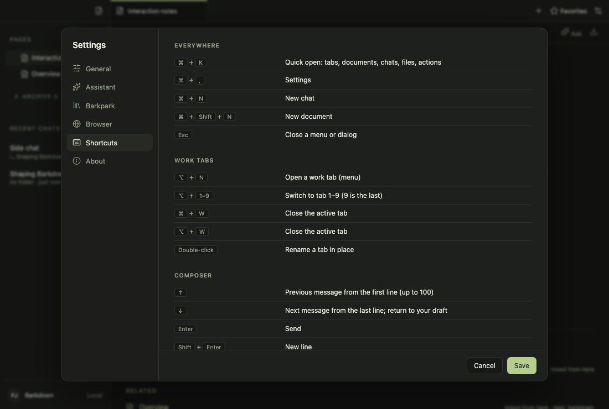

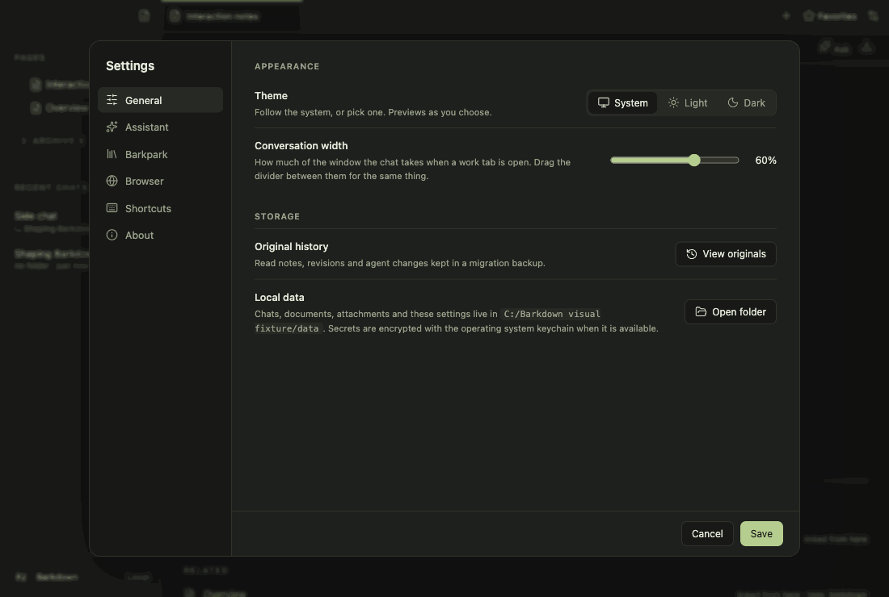

## goals

Goal component with explicitly injected fixture snapshots and providers blocked. Saved worker chats use the ordinary composer; this is not live scheduler/provider proof.

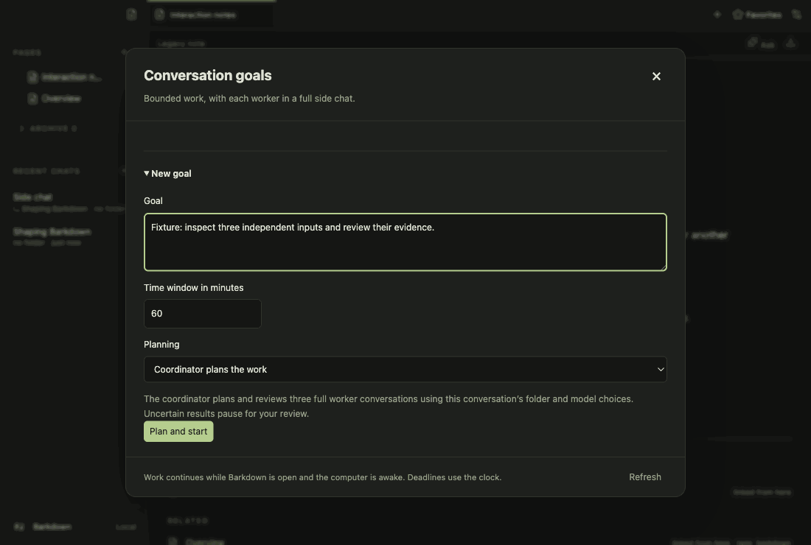

## profiles

Profile Settings controls with injected stable registry names. This tour makes no profile switch; real switching and Paper save protection have separate integration evidence.

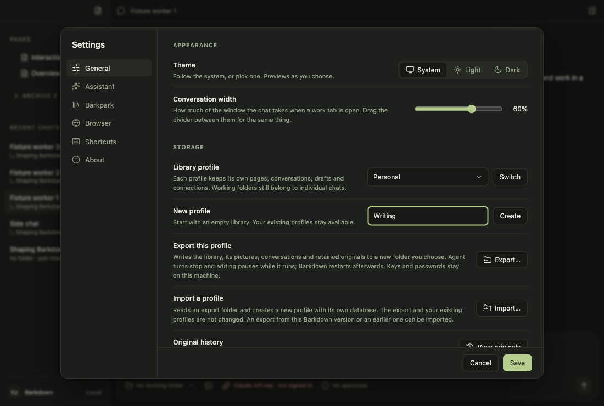

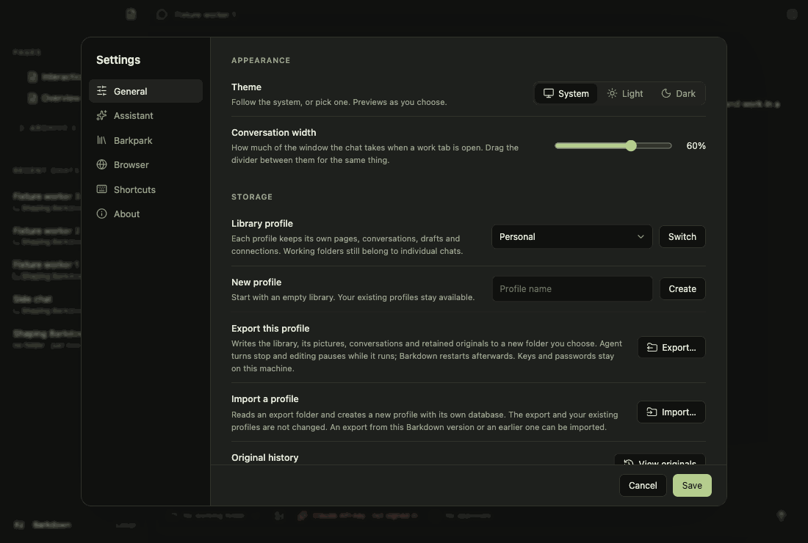

## adoption

Real recovery window with explicit fixture states; no migration is performed in this visual tour. Actual transaction/restart proof is separate.

