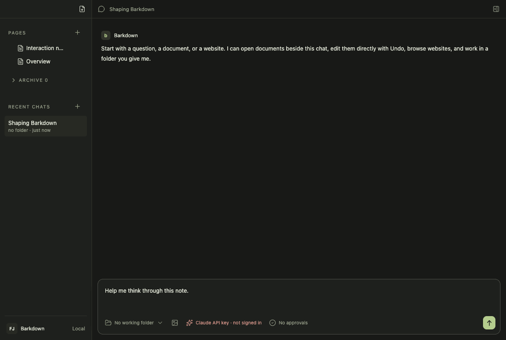
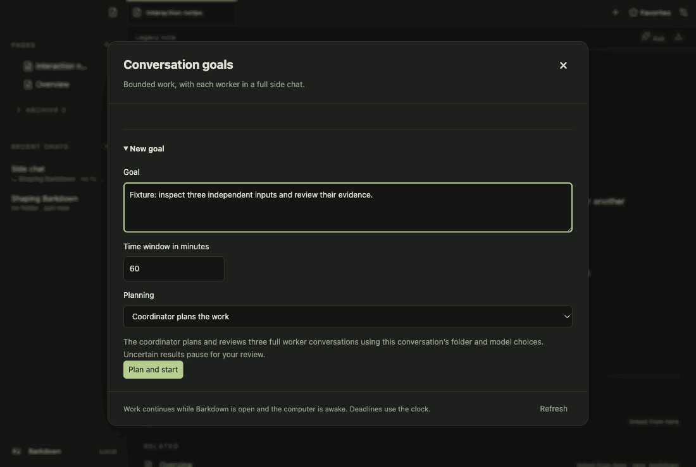

# Visual health on darwin

Approved fixture captures of the real Electron UI on darwin (OS 24.5.0, Electron 44.5.1). The primary gallery in [README.md](README.md) is the Windows source machine's; this page stands beside it, never in its place. See [rules](RULES.md).

Reviewed by feat-barkdown-3 builder (Opus). A mention waits for an open note to finish saving before the send reads it; a save that fails or does not finish in 4 s sends the last saved text with a toast. Inspected run 2026-11-18T21-20-31-201Z against 2026-11-18T10-07-32-545Z: every frame within tolerance or noise; settings-assistant differs only in the temp folder of the command-line path (another worktree), quick-open, workspace narrow, side-chat draft/ready and goals narrow by a few pixels with no geometry change. The fixture tour never mentions a note, so the wait and the toast are not in it; they are proven by app/tests/note-mention.live.mjs (real Electron, carried runtime 1482fb675, scripted API SDK; 11/11 passed at 6ab33b4b: typing in the open note and sending in the same tick sends the just-typed words; a conflicting save sends the last saved version with the toast "Saffron launch plan has unsaved edits; the assistant got the last saved version.", screenshot inspected). The same live test fails on 713e5ee5 at the just-typed step. Limits: no narrow-width picture of the toast; Windows not captured.

Source commit: a6ef4062a17247b2f25f8d40dce22469e1d67001; review: docs/visual/reviews/approval-49292b6b70d376b939e8997464db1e0638d0b2067290355f3f5a5dab3dd5d186.json.

## workspace

Real desktop navigation with disposable local notes; no cloud or provider.

## chat

Shared main composer: draft, provider chooser and model chooser. No message is sent.

## side-chat

A real saved side conversation and its independent composer, using disposable fixture state.

## documents

Read-only legacy document viewer. The light frame is a theme-contrast comparison; no Paper server or editing is used.

## retained

After the library switch the legacy notes are retained read-only. Dark by default; the light frame compares theme contrast. Fixture journal; no Paper server.

## settings

Real Settings navigation. No server connection or credential is configured.

## goals

Goal component with explicitly injected fixture snapshots and providers blocked. Saved worker chats use the ordinary composer; this is not live scheduler/provider proof.

## profiles

Profile Settings controls with injected stable registry names. This tour makes no profile switch; real switching and Paper save protection have separate integration evidence.

## adoption

Real recovery window with explicit fixture states; no migration is performed in this visual tour. Actual transaction/restart proof is separate.

