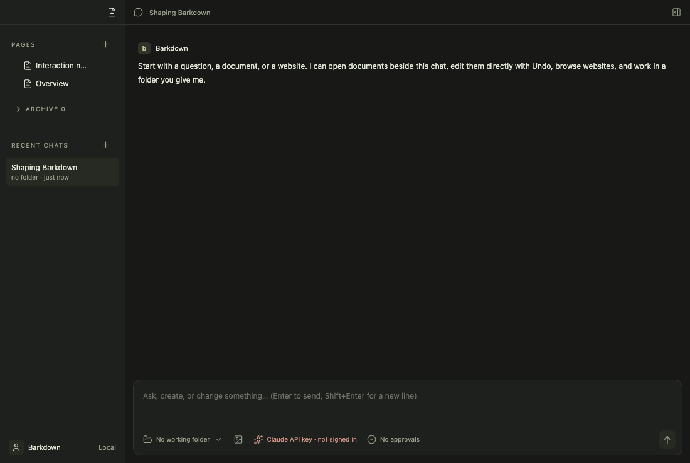
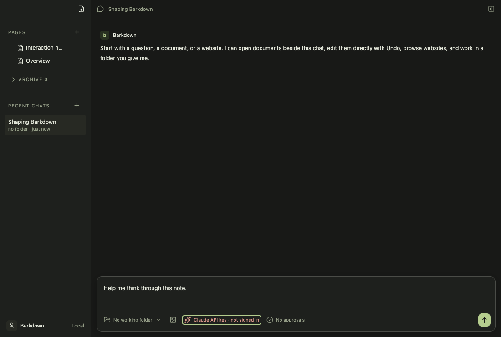
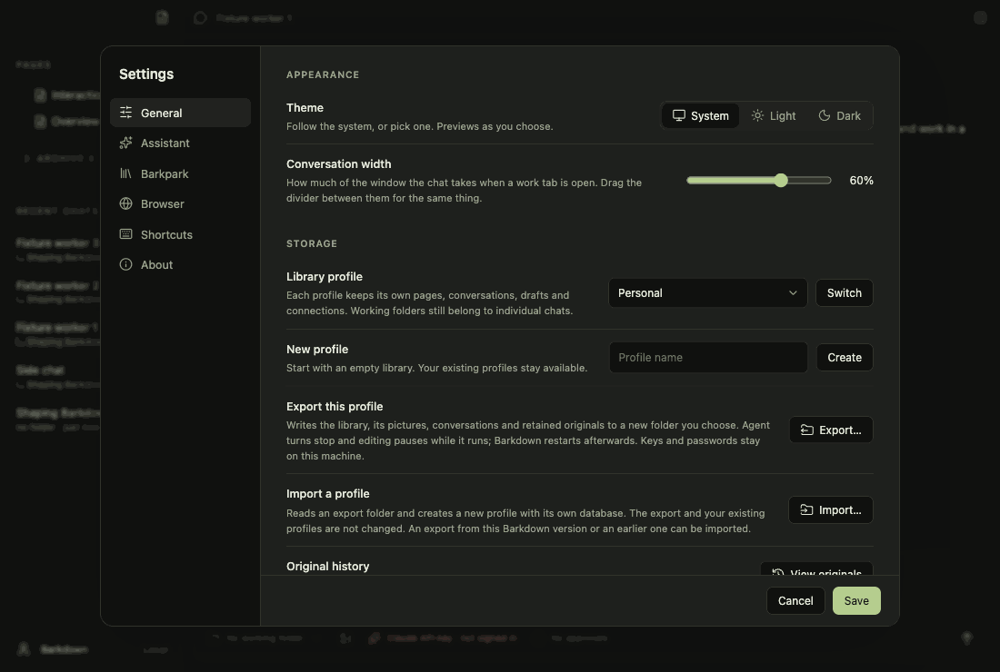

# Visual health on darwin

Approved fixture captures of the real Electron UI on darwin (OS 24.5.0, Electron 44.5.1). The primary gallery in [README.md](README.md) is the Windows source machine's; this page stands beside it, never in its place. See [rules](RULES.md).

Reviewed by feat-barkdown-3 builder (Opus). Demo names branch merged with main (#152, #156). Inspected every state against main's darwin baseline: settings/assistant differs only in the random temp folder of the Command line path; workspace/quick-open and side-chat open/draft differ by one to three antialiased pixels. Badge shows the person icon throughout.

Source commit: 154ac75ca12c47f2fcb479a1a8d28272734d02ff; review: docs/visual/reviews/approval-46ae8c5812a3206ddf7ccd4fef91e9defc3986406bdb0006913d9ce447abbdae.json.

## workspace

Real desktop navigation with disposable local notes; no cloud or provider.

## chat

Shared main composer: draft, provider chooser and model chooser. No message is sent.

## side-chat

A real saved side conversation and its independent composer, using disposable fixture state.

## documents

Read-only legacy document viewer. The light frame is a theme-contrast comparison; no Paper server or editing is used.

## retained

After the library switch the legacy notes are retained read-only. Dark by default; the light frame compares theme contrast. Fixture journal; no Paper server.

## settings

Real Settings navigation. No server connection or credential is configured.

## goals

Goal component with explicitly injected fixture snapshots and providers blocked. Saved worker chats use the ordinary composer; this is not live scheduler/provider proof.

## profiles

Profile Settings controls with injected stable registry names. This tour makes no profile switch; real switching and Paper save protection have separate integration evidence.

## adoption

Real recovery window with explicit fixture states; no migration is performed in this visual tour. Actual transaction/restart proof is separate.

