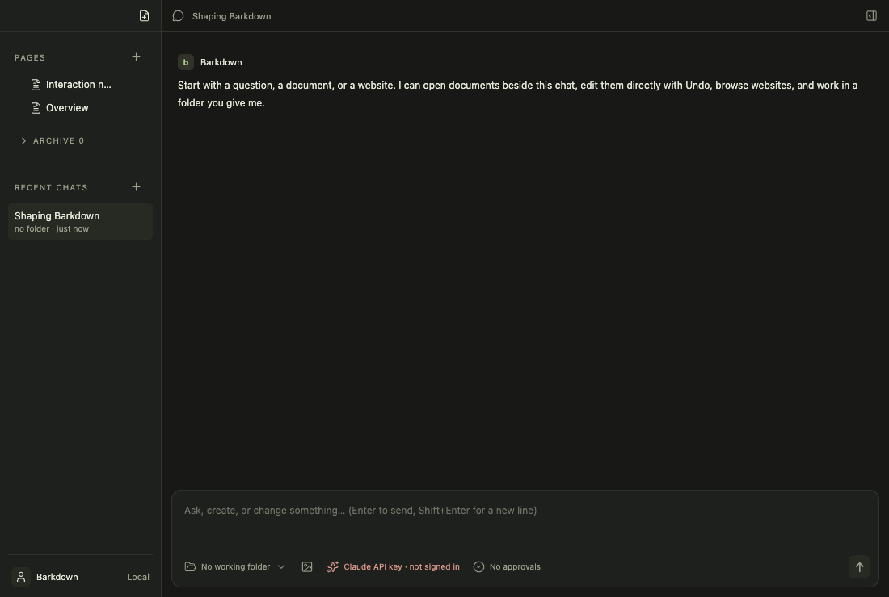
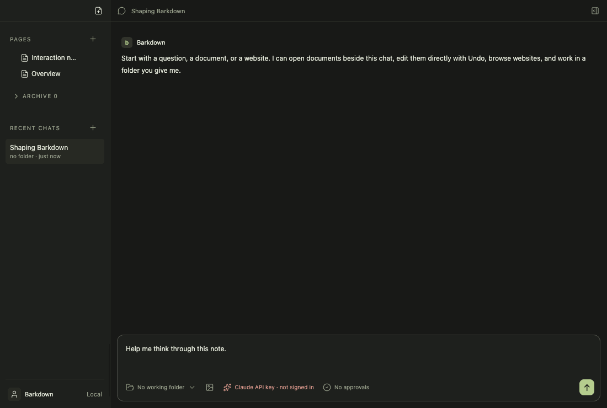
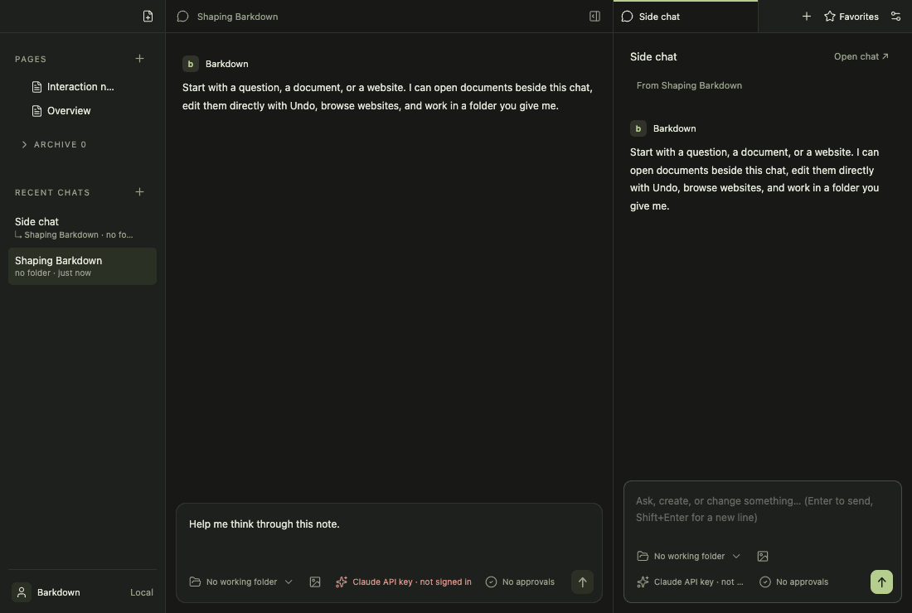
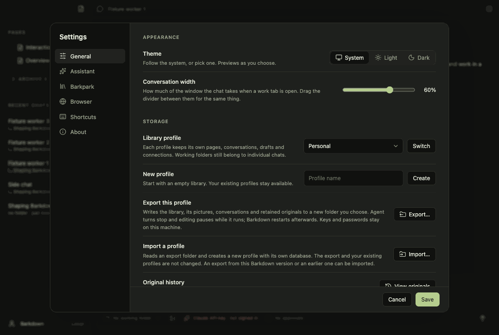

# Visual health on darwin

Approved fixture captures of the real Electron UI on darwin (OS 24.5.0, Electron 44.5.1). The primary gallery in [README.md](README.md) is the Windows source machine's; this page stands beside it, never in its place. See [rules](RULES.md).

Reviewed by feat-barkdown-3 builder (Opus). macOS run 2026-11-19T19-44-40-195Z at c8799d0c (bp runner; tests and package scripts only, no app source) approved against 2026-11-19T17-45-16-451Z: 42 frames within tolerance; settings-1 differs only in the per-run temp folder name under Settings > Command line; workspace-1 by one anti-aliased pixel beside Project editor

Source commit: c8799d0c1f22ab6c2d58d5d74a7f8563b07f206c; review: docs/visual/reviews/approval-c251b319abc35f2be50a3800acb85e233dea4799b293e1625f61a05cc4113a93.json.

## workspace

Real desktop navigation with disposable local notes; no cloud or provider.

## chat

Shared main composer: draft, provider chooser and model chooser. No message is sent.

## side-chat

A real saved side conversation and its independent composer, using disposable fixture state.

## documents

Read-only legacy document viewer. The light frame is a theme-contrast comparison; no Paper server or editing is used.

## retained

After the library switch the legacy notes are retained read-only. Dark by default; the light frame compares theme contrast. Fixture journal; no Paper server.

## settings

Real Settings navigation. No server connection or credential is configured.

## goals

Goal component with explicitly injected fixture snapshots and providers blocked. Saved worker chats use the ordinary composer; this is not live scheduler/provider proof.

## profiles

Profile Settings controls with injected stable registry names. This tour makes no profile switch; real switching and Paper save protection have separate integration evidence.

## adoption

Real recovery window with explicit fixture states; no migration is performed in this visual tour. Actual transaction/restart proof is separate.

