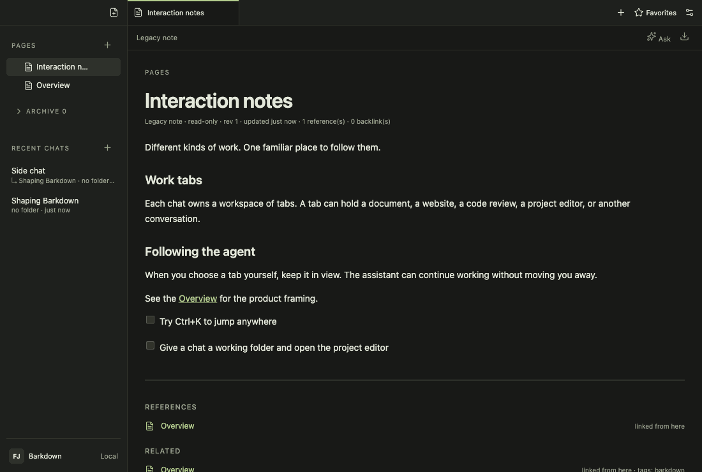
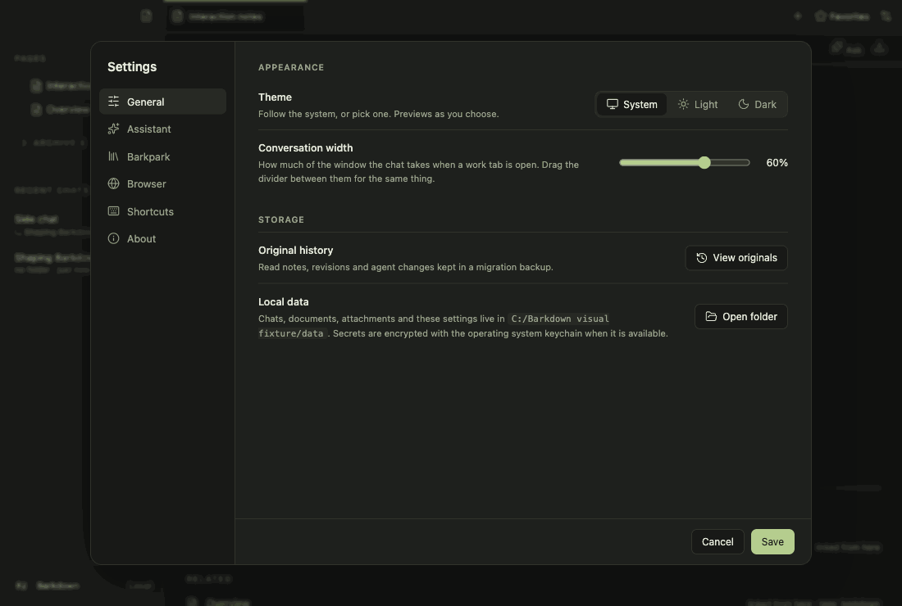

# Visual health on darwin

Approved fixture captures of the real Electron UI on darwin (OS 24.5.0, Electron 44.5.1). The primary gallery in [README.md](README.md) is the Windows source machine's; this page stands beside it, never in its place. See [rules](RULES.md).

Reviewed by feat-barkdown-3 builder (Opus). Note outline (task-c07e746760cbedc1), recapture after the observers became open-only (fixes paper-host on CI). Compared with the previous approved run 2026-11-18T06-06-39-781Z: settings: assistant differs only in the random temp path of the command-line text; side-chat: open is a few pixels on the send button. The fixture tour opens only legacy notes and Settings, so it never reaches a Paper path bar or the Outline panel (no tour step added); the Settings > Shortcuts row for Ctrl+Shift+O is below the captured fold. The panel is shown in the live Paper evidence docs/cycles/evidence/note-outline/live/2026-11-18-note-outline-live (wide, highlighted jump, typed heading, narrow overlay, no headings, 300 headings) and the new button in the status pictures. Behavior: tests/note-outline.test.mjs 8/8, tests/paper-host.test.mjs passes, tests/note-outline.live.mjs 11 checks passed in real Electron on the carried runtime.

Source commit: 49b6d6d0a0ef4c146e87fbdf4af91b60130fa46e; review: docs/visual/reviews/approval-513ef22dd6a38c9fbbad811dbb52f435b387c49ef95b58279597fea1231243fb.json.

## workspace

Real desktop navigation with disposable local notes; no cloud or provider.

## chat

Shared main composer: draft, provider chooser and model chooser. No message is sent.

## side-chat

A real saved side conversation and its independent composer, using disposable fixture state.

## documents

Read-only legacy document viewer. The light frame is a theme-contrast comparison; no Paper server or editing is used.

## retained

After the library switch the legacy notes are retained read-only. Dark by default; the light frame compares theme contrast. Fixture journal; no Paper server.

## settings

Real Settings navigation. No server connection or credential is configured.

## goals

Goal component with explicitly injected fixture snapshots and providers blocked. Saved worker chats use the ordinary composer; this is not live scheduler/provider proof.

## profiles

Profile Settings controls with injected stable registry names. This tour makes no profile switch; real switching and Paper save protection have separate integration evidence.

## adoption

Real recovery window with explicit fixture states; no migration is performed in this visual tour. Actual transaction/restart proof is separate.

