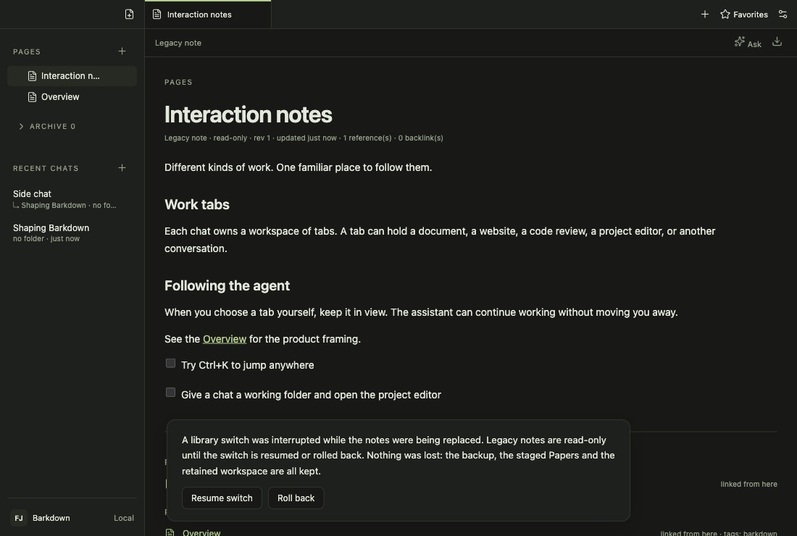

# Visual health on darwin

Approved fixture captures of the real Electron UI on darwin (OS 24.5.0, Electron 44.5.1). The primary gallery in [README.md](README.md) is the Windows source machine's; this page stands beside it, never in its place. See [rules](RULES.md).

Reviewed by feat-barkdown-3 builder (Opus). Daily notes (Today's note in quick open, Cmd/Ctrl+Shift+D, calendar button beside Pages +, Previous/Next day in a daily note's path bar). Run 2026-11-18T09-16-09-010Z vs 08-41-15-230Z on darwin at d3d8539f (merged with main b18cebb4). I looked at every changed frame: workspace quick-open differs by one anti-aliased pixel; settings assistant differs only in the random temp folder name in the Command line path. Every other still has 0 changed pixels and the same geometry. The tour has no profile or local library, so it never shows the new controls (Today's note row, calendar button, day steps). Those appear in the live test screenshots instead: docs/cycles/evidence/daily-note/live/2026-11-18-daily-live (01 today, 02 missing day, 03 yesterday, 04 deleted and new), where I checked layout at 1300x900, including the day nav wrapping in the narrow work pane. Behavior: app/tests/daily-note.test.mjs 7/7; app/tests/daily-note.live.mjs passed 6/6 on 60ddf75b.

Source commit: d3d8539f58627df192f88592f703415a3107c36f; review: docs/visual/reviews/approval-9f6928437ec77dd0a2ce4c9dc892ea69601178b6f1aec0318ce0b381d5cbe714.json.

## workspace

Real desktop navigation with disposable local notes; no cloud or provider.

## chat

Shared main composer: draft, provider chooser and model chooser. No message is sent.

## side-chat

A real saved side conversation and its independent composer, using disposable fixture state.

## documents

Read-only legacy document viewer. The light frame is a theme-contrast comparison; no Paper server or editing is used.

## retained

After the library switch the legacy notes are retained read-only. Dark by default; the light frame compares theme contrast. Fixture journal; no Paper server.

## settings

Real Settings navigation. No server connection or credential is configured.

## goals

Goal component with explicitly injected fixture snapshots and providers blocked. Saved worker chats use the ordinary composer; this is not live scheduler/provider proof.

## profiles

Profile Settings controls with injected stable registry names. This tour makes no profile switch; real switching and Paper save protection have separate integration evidence.

## adoption

Real recovery window with explicit fixture states; no migration is performed in this visual tour. Actual transaction/restart proof is separate.

